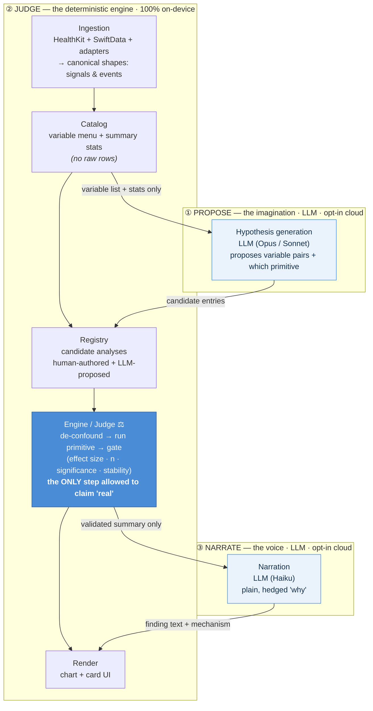
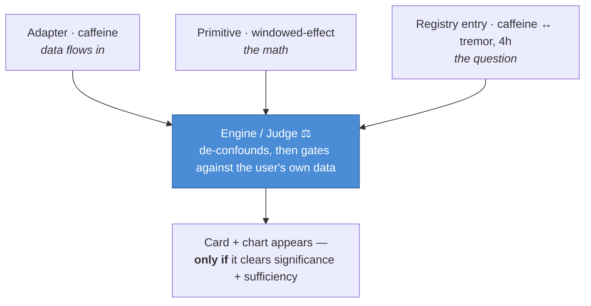

# Kampa — Insight Intelligence Architecture

> **Status:** Decided June 2026. This is the most fundamental design decision in Kampa so far — bigger than CloudKit sync. It defines *how the app turns raw sensor data into trustworthy insights*.

---

## The fork in the road

There were two tempting-but-wrong extremes for how Kampa generates insights:

| Extreme | Why it's wrong |
|---|---|
| **"Just ask an LLM."** Throw the CSVs at a model and let it tell us what correlates. | LLMs are not calculators. They estimate and pattern-match on text — they don't *compute* a correlation or a survival curve. Ask one to find patterns and it will, including ones that aren't there. For a health app, that's the worst possible failure. |
| **"Pure statistics, fixed forever."** A hand-coded engine that only ever runs the analyses one person thought to write. | Rigorous but blind. It can only find what was hand-modelled in advance. New variables and other users' data would carry signal the app simply can't see. |

**The resolution: don't choose. Layer them, and wall the LLM off from the one job it's catastrophic at — being the statistician.**

---

## The three-layer design

Read it as **three layers**, each doing only what it is genuinely good at: an LLM **proposes** what to test, a deterministic engine **judges** what is real, an LLM **narrates** the survivor. The seven numbered steps are the detail *inside* those three layers - and only the middle layer (②, the Judge) may ever decide a pattern is true.



*Read top-to-bottom as **three layers**: **① Propose** — an LLM imagines what's worth testing; **② Judge** — a 100%-on-device deterministic engine (ingest → catalog → registry → judge → render) in which only the gated **Judge** step may ever call a pattern real; **③ Narrate** — an LLM puts the survivor into plain words. The cross arrows are the only data that moves between layers: the Catalog hands the LLM a privacy-safe menu, the LLM's proposals enter the Registry, and the Judge's validated summary is the only thing narration is allowed to speak. (The numbered table below details the steps inside these layers in data-flow order.)*

| # | Layer | Job | Tool | Why this tool |
|---|---|---|---|---|
| 1 | **Ingestion** | Pull each variable in and map it to a shape | Code + adapters | Deterministic plumbing |
| 2 | **Catalog** | "What variables exist + their summary stats" | Code | The privacy-safe menu sent out for ideas |
| 3 | **Hypothesis generation** | Propose *what's worth testing* — incl. pairings the developer wouldn't think of | **LLM** | Breadth. Knows PD pharmacology; proposes *plausible* hypotheses |
| 4 | **Registry** | Hold the candidate analyses (human + LLM) | Code (config) | Composable list of questions |
| 5 | **Engine / Judge** ⚖ | *De-confound, then test* each hypothesis + gate it | **Code only** | The only layer permitted to say a pattern is real |
| 6 | **Render** | Draw the chart + card | Code | Domain-specific, clinician-grade visuals |
| 7 | **Narration** | Explain the survivor in plain, hedged words | **LLM** | Voice. Good at language + framing |

**The golden rule:** the LLM is the *imagination* (layer 3) and the *voice* (layer 7). It is **never** the *judge* (layer 5). Only deterministic statistics can promote a hypothesis to a visible insight.

---

## The three building blocks (crisp definitions)

These are the parts that make the engine extensible. Think of a kitchen:

| Block | Definition | Kitchen analogy | Examples |
|---|---|---|---|
| **Adapter** | Brings a **new stream of data** into the system. One per variable. Fetches it (HealthKit query) or captures it (logging UI), then maps it to a canonical *shape*. | **The ingredient** — gets it into the kitchen | caffeine, boxing, Tai Chi, CGM glucose, constipation |
| **Primitive** | A reusable **statistical method** that operates on *shapes*, not on specific variables. It neither knows nor cares which variable it's fed. Built once, reused forever. | **The cooking technique** — sautéing works on any vegetable | windowed-effect, lag-correlation, dose-response curve, survival / duration, long-term trend |
| **Registry** | The list of **questions**. Each entry wires one variable pair to one primitive with parameters. It is *configuration, not new code*. | **The recipe card** — "sauté *this* ingredient *this* way" | `caffeine ↔ tremor` via windowed-effect (4h)<br>`dose ↔ tremor` via dose-response (by time-of-day) |

### The two shapes everything reduces to

Every adapted variable is exactly one of:

- **Continuous signal** — a value that exists over time. *(tremor, HRV, glucose, gait speed)*
- **Discrete event** — a thing that happened at a timestamp. *(a dose, a meal, a coffee, a workout)*

Primitives are written against these two shapes — which is *why* one primitive serves many variables. "What is the effect of an **event** on a **signal** in the hours after it?" is the same math whether the event is a levodopa dose or a cup of coffee.

### How they compose



**Adding a new variable is a thin, mostly-declarative act:** write one adapter + one registry line. Everything downstream — running on every user, gating, charting, narrating — is automatic and per-user.

---

## What's automatic vs. what needs a human

| Step | Automatic? |
|---|---|
| Stats run on each user's own data | ✅ |
| Drop dose-shadowed events before gating (the dose-confound guard) | ✅ |
| Show / hide per user via the significance gate | ✅ |
| A serviceable chart (the primitive's default renderer) | ✅ |
| The numeric "finding" text | ✅ |
| Getting a variable's **data** into the app | ❌ — adapter (small, once) |
| The variable-pair **question existing** | ❌ — registry entry (human-curated, *or* LLM-proposed) |
| A **polished, bespoke** chart + the mechanism "why" | ❌ — hand-authored *or* LLM narration |

**The one burden that never automates away:** you cannot analyze data you do not collect. The LLM can propose "test temperature vs. tremor," but if temperature isn't a stream, there's nothing to test. The adapter is permanent and human.

---

## Why this beats pure LLM "discovery" — on quality *and* safety

- **Quality.** The insights we've already built encode domain-specific statistical models a generic scanner could never invent — e.g. dose-response = onset-latency *by time-of-day bucket, truncated at the next dose, baseline-corrected*; wearing-off = *Kaplan-Meier survival with censoring*. Automated discovery only ever produces shallow "X correlates with Y" cards. **The primitives carry clinician-grade quality; the LLM carries breadth.**
- **Safety.** Scanning every variable pair for "anything significant" is a false-discovery machine — test enough pairs at p<0.05 and chance alone manufactures hits. The LLM's value is as a *prior*: it proposes only *mechanistically plausible* hypotheses, which keeps the number of tests small and each hit more likely to be real. The gate then enforces discipline: multiple-comparison correction, minimum effect size, minimum n, and replication across time windows before anything is shown.

---

## The Judge is confounder-aware (the dose-confound guard)

A windowed-effect primitive, on its own, is **confounder-blind**: it measures the signal in the hours after an event and credits any change to that event. In Parkinson's that is dangerous, because the single most powerful thing that moves the signal — a **levodopa dose** — is correlated with almost everything else the patient does. Coffee gets drunk near doses; exercise happens *because* the patient is already ON. So a naive windowed-effect quietly attributes the *medication's* ON-effect to whatever event happened to share its window.

This is not hypothetical — it surfaced on real data (Jun 21). The caffeine card first read **"Caffeine eases your tremor — Strong — 32% lower."** Almost certainly the levodopa, not the caffeine: coffee is habitually taken near doses, so the post-coffee window rode the dose's ON-effect, and the confounder-blind primitive handed the credit to the coffee. A plausible mechanism in the same direction (caffeine is an adenosine A2A antagonist — the istradefylline target) makes a confounded result *more* seductive, not more proven.

**The fix is a primitive-level guard (`doseCleanEvents`), applied to every non-medication windowed exposure** (food, exercise, mindfulness — the dose-as-exposure dyskinesia path never reaches it and is naturally skipped):

- Before gating, **drop any event whose measurement window is dose-shadowed** — a levodopa dose falling within `[eventStart − onWindow, eventEnd + postWindow]`.
- `onWindow` is **per-user**, sourced from the *same* Kaplan-Meier median ON-duration the wearing-off card computes (~192 min for this user), with `[90, 360]`-min sanity rails and a fallback. A user whose ON window is shorter gets a tighter shadow.
- Only events that give a clean read of the exposure's *own* effect survive to the gate.

It is deliberately **conservative**: for an exposure habitually taken near doses, n collapses and the honest output is "can't separate this from your medication" (no card) rather than a confident, wrong claim. On-device this flipped caffeine from **"Strong / −32% / 52 servings"** to **"Emerging / +9% / 13 dose-clean servings."** The **sign flip** (−32% → +9%) once dose-shadowed servings are removed is the proof that the original "benefit" was the medication. Sugar, with fewer than 5 dose-clean servings, correctly surfaces nothing — the gate's n-floor doing its job on the other side.

**Why this lives in the Judge — not the Adapter or the Registry.** Confounding is a property of *the data and the question*, not of how a variable was ingested. So the guard belongs in the deterministic judging layer, alongside the gate that already enforces n / effect / significance / stability. It is a fourth discipline the Judge applies before it will call a pattern real: **de-confound, then gate.** And because the mechanism is reverse causation as much as correlation (you exercise *because* you're ON), the guard is **general across exposures**, not a food-specific patch — which is exactly why it earns a place in the architecture rather than in one card's code.

---

## Privacy boundary

Raw health data **never leaves the device.** The two opt-in API hops carry only:

1. **Outbound for hypotheses:** the variable *menu* + summary statistics (not rows).
2. **Outbound for narration:** the *validated derived summary* (the numbers a finding rests on).

On-device: ingestion, catalog, registry, engine/judge, gate, rendering.
API (opt-in): hypothesis generation, narration.
This is consistent with the existing CloudKit ≠ third-party-API boundary.

---

## The three existing cards are *not* discarded

Today's cards (afternoon-dose, wearing-off, gait) are bespoke functions that bundle four things together:

```
afternoonDoseInsight()  =  [data selection] + [statistical method] + [chart] + [hardcoded text]
```

The refactor **decomposes** them into the reusable layers — nothing of value is lost:

| Today (bundled) | After (decomposed into reusable parts) |
|---|---|
| `afternoonDoseInsight()` | **primitive:** windowed dose-response · **registry:** dose ↔ tremor · **renderer:** multi-curve chart |
| `wearingOffInsight()` | **primitive:** survival / ON-duration (Kaplan-Meier) · **registry** · **renderer:** trough-annotated curve |
| `gaitInsight()` | **primitive:** long-term trend (regression over monthly medians) · **registry** · **renderer:** trend chart |

The statistics, the charts, and the **parity tests** all survive and get *reused*. The bespoke shells dissolve, but they become **the first three primitives and the gold-standard reference implementations** — the templates every future (LLM-proposed) analysis is held to. They are the proof that this architecture is buildable.

---

## Migration path (staged — nothing breaks)

1. Leave the three cards running exactly as-is.
2. Extract **one** primitive (start with gait's trend-regression — the cleanest). Re-express the card as `registry entry → primitive`. Parity tests prove the output is identical. Ship.
3. Repeat for dose-response, then survival. Three primitives + a thin registry, still producing today's exact cards.
4. Add the **gate** layer (significance + sufficiency + multiple-comparison correction).
5. Add **LLM hypothesis generation** feeding candidate registry entries.
6. Swap hardcoded narration for **LLM narration**, keeping today's strings as a deterministic fallback.

Each step is independently shippable; the parity tests are the safety net.

---

## Build status (Jun 2026) & the renderer dimension

The architecture is **fully migrated and on-device**, all parity-green: the confidence-gate primitive, the typed registry (21 entries, now the execution driver), the workout adapter, the generic `windowedEffect` primitive + its trajectory chart, the gait `longTermTrend` primitive, **and now the two dose primitives (`doseResponseByTimeOfDay` + `survivalDuration`) plus the renderer dimension** (see below). A real 32-session walking card surfaced on-device and correctly read **"no clear effect yet"** — the engine declining to manufacture a 6% null into a claim. Adding an activity is now a registry line with zero code.

**Primitive vs. renderer — the split made explicit.** Decomposing a bespoke card yields two separable things: the **primitive** (the math — always generic) and the **renderer** (the card's display — generic *or* bespoke). The windowed-effect cards use a *generic* renderer. **Gait uses a bespoke composite renderer** — it fuses four mobility markers into one reassurance card — and that is *correct*, not leftover hard-coding. Primitives must be generic; renderers may be bespoke when the card genuinely is.

**The renderer dimension (the mechanism that retired the dispatch shim).** Dispatch cannot key on the primitive alone: `.longTermTrend` does not uniquely identify the gait composite (a future "step-length trend" entry would share the primitive). So each `RegistryEntry` carries a **`renderer`** descriptor (`.windowedEffect` / `.gaitComposite` / `.doseResponse` / `.wearingOff`), and `run()` dispatches on it — deleting the transitional id-switch for *all* bespoke cards at once. This is what lets every entry be fully self-describing (exposure · outcome · primitive · **renderer** · gate) and makes routing data-driven. Status: **built (commit `cf9a400`).** `run()` now switches on `entry.renderer`, reading each renderer's stats params from `entry.primitive`; the id-switch is gone and all four cards share one dispatch. The two dose cards were decomposed the same way the gait card was — generic primitives (`doseResponseByTimeOfDay`, `survivalDuration`) over the (signal, events) shapes, with `buildTraces`/`analyzeWearingOff` kept as thin parity adapters and `afternoonDoseInsight`/`wearingOffInsight` as the bespoke renderers. An end-to-end parity test confirms `generateInsights` surfaces all three built cards through the new dispatch (the seam the direct-call tests skipped), and the change was verified on-device — all four cards render identically.

**Food cluster, the `category` field, and the dose-confound guard (commit `048d46c`).** Three additions land on top of the completed migration:

- **Food cluster** — a generic **`FoodIntakeEvent`** adapter (carrying the detected `FoodAttribute` set) plus a **`.foodAttribute`** exposure mirror the workout adapter exactly. `caffeine ↔ tremor` and `sugar ↔ tremor` are now **one registry line each, with zero new statistics** — the clearest proof yet of the thesis that *a new variable is a registry line, not code*. The `windowedEffect` renderer was generalized so food and exercise diverge in exactly one place (the event stream + mechanism copy); the math, gate, chart, and guard are all shared. No CloudKit change (`FoodEvent` already existed).
- **`category` field** on every entry (medication / exercise / food / sleep / stress / mobility) — the grouping axis for a future clustered Insights layout. **Semantic category** (on the entry) and **display grouping** (a UI policy) are kept as separate layers, so the field is inert until the layout is built; reassigning a category is a one-line static-config change, no migration. (A horizontal-carousel layout was rejected as tremor- and VoiceOver-hostile in favor of collapsible vertical sections, deferred until 8+ live cards exist to design against.)
- **Dose-confound guard** — the architecturally significant one; see [The Judge is confounder-aware](#the-judge-is-confounder-aware-the-dose-confound-guard) above. It made the generalized windowed-effect primitive safe to point at exposures habitually taken near a dose, and was verified on-device by the caffeine sign-flip.

---

## Scaling past solo: demand-sensing & deployment for many users

The human-in-the-loop seam above ("LLM proposes → Bhav approves a PR") is described at **solo scale**. Once Kampa ships to TestFlight and the App Store, a new question appears: *if a hypothesis only matters for someone else's data, how does the builder ever learn it's worth wiring?* The privacy design makes this genuinely hard **on purpose** — and the resolution is one of the more important decisions in this document.

### The cost we accepted

Raw data never leaves the device. That moat is Kampa's central differentiator — but it **deliberately removes the feedback loop most apps rely on**: you cannot watch a dashboard of user behavior to decide what to build, because you refused to centralize it. This is a real cost, not a bug. The mechanisms below are the privacy-preserving *replacements* for that loop. Name the trade honestly whenever it comes up: we gave up centralized analytics to keep the moat.

### The 80 / 20 split

| Tier | What it covers | How the question comes to exist | Example |
|---|---|---|---|
| **Pre-wired ~80%** | The known PD hypothesis space | **Curated as static registry lines, shipped to everyone** | Tai Chi, boxing, yoga, cycling, strength, sleep↔tremor, protein-timing↔dose-onset |
| **Discovered ~20%** | The obscure / idiosyncratic pairing nobody would pre-curate | **Federated proposal-voting** (below) | afternoon humidity ↔ tremor, an unusual supplement, a personal idiosyncrasy |

The key reframe for the pre-wired tier: **you are not running analyses on a population from a dashboard. You ship a *menu of questions*, and each device answers them about itself.** Tai Chi reducing PD tremor is textbook — so it ships as a registry line from day one, runs on every device against *that user's own* data, and gates itself locally. Vikas gets his Tai Chi insight from his own data; the builder never sees the data and never even knows Vikas does Tai Chi. *That is the design working as intended* — the moat and the insight are not in tension, because the judging is local.

Corollary: a generic **workout adapter** (ingests every `HKWorkoutActivityType` as a tagged discrete event) means Tai Chi, boxing, pickleball etc. need **no new adapter** — only a registry line. New *adapters* are reserved for genuinely new data streams (CGM, constipation logging), which no amount of on-device intelligence can conjure — there must be a stream to test.

### Three demand-sensing mechanisms (in order of when they earn their place)

1. **Pre-curate aggressively — *now*.** The PD exercise/lifestyle literature is rich; most high-value hypotheses are knowable in advance. Curate them as registry lines. Covers the 80%, needs zero telemetry.
2. **Explicit user feedback — *near-term, honest*.** An in-app "I think X affects my symptoms / suggest an insight" affordance, plus users simply telling you. Zero privacy cost, realistic for a small beta. Don't over-build (2) before the beta justifies it.
3. **Federated proposal-voting — *the elegant later*.** Run the LLM proposer **on-device** against each user's local catalog. When a device proposes a registry entry (e.g. `taiChi ↔ tremor`), it sends back — opt-in, de-identified, thresholded across N users + differential-privacy noise — **only the proposal itself: the variable-pair, as a vote.** Not the data, not the tremor numbers. You aggregate **hypotheses, not health data**: a variable-pair name is not PII. When 40 devices independently propose the same pairing, *that* is your demand signal, and you author/approve the registry line once.
   - **Leak caveat:** even a bare proposal ("this user's LLM proposed humidity↔tremor") implies the user has that variable and symptom variation. So it only works **aggregated, with a count threshold + DP noise — never per-user.** Consistent with the federated/DP direction in `project_kampa_cross_user_data`.

### Deployment: why a registry entry can ship without an App Store resubmit

Once you decide to add a question, *how* it reaches existing users depends on the config-vs-code split:

| Artifact | Nature | Deployment |
|---|---|---|
| **Registry entry** | *Config* over a primitive + adapter already in the binary | **Remote config** — push the question; each device runs and gates it locally. No resubmit. |
| **New primitive** | Code (statistics) | App update |
| **New adapter** | Code (data ingestion) | App update |

**Tai Chi is the easy case**: a registry line over the already-shipped workout adapter + windowed-effect primitive → pure remote config. This is the exciting payoff — you can deploy a new *validated* question to all users instantly. With the same seriousness as code: **parity-tested, gated, and with a rollback path.** Remotely pushing statistics to a health app is exactly as serious as shipping them.

### The invariant that holds at every scale

| Scale | "Approve into the engine" = |
|---|---|
| Solo / TestFlight | Your **PR** (registry diff you merge) |
| Multi-user / App Store | Your **remote-config push** |

What never changes: **no device ever self-approves an LLM-proposed analysis.** Promotion of a hypothesis into the deterministic engine is always a deliberate *human* act — yours. The LLM proposes; the population's devices *vote* by proposing independently; you *approve*; the gate *judges* locally. That seam is the whole point of the walled-off judge, and it is the same seam at 1 user or 10,000.

---

## The builder's review surface — how approval actually happens

The seam above says "Bhav approves a PR." This section defines what that *experience* concretely is for the solo builder, because the mechanics are the part most easily misunderstood.

### The one distinction that makes it click: you approve *questions*, not *answers*

There are two separate approvals, and the human only ever performs the first:

| Approval | What it decides | Who | When |
|---|---|---|---|
| **Question → registry** | "Is this hypothesis sane and *safe* to let the engine test?" | **Human (you)** | At review time |
| **Answer is real** | "Does this pattern clear effect size + n + significance + stability?" | **Engine, deterministically** | Per-user, automatic |

Approving the registry entry is **never** "Bhav blessed the conclusion that Tai Chi helps." It is "Bhav agreed Tai Chi-vs-tremor is a sound, safe *question*." The engine then judges the answer against each user's own data and may surface nothing. This is the entire safety story: a human admits hypotheses to the test set; only deterministic statistics promote one to a visible insight.

### What a proposal looks like when it reaches you — a hypothesis *card*, not raw code

The registry entry is a trivial typed struct literal (~6 lines) that the tooling writes; you never hand-author syntax. What you review is the *reasoning*:

```
PROPOSED INSIGHT — Tai Chi ↔ tremor
Plain question:  "Does Tai Chi lower your tremor in the 2h after a session?"
Why proposed:    8 Tai Chi sessions logged; tremor avg runs lower on those days.
Mechanism/prior: Tai Chi → reduced PD tremor is well-supported in the literature.
Primitive:       windowed-effect (exists — config-only, no new code)
Safety class:    Lifestyle experiment (patient-controllable). NOT a medication lever.
Data readiness:  n=8 sessions; gate needs ≥5 → testable now.
Diff:            +1 registry line (collapsed)
```

The hard part of the review is the **judgment** — plausible? safe? not a dosing instruction in disguise? not noise-fishing? — and the card puts exactly that in front of you. The code is the artifact, not the work.

### The surface (near-term): a Claude Code conversation, recorded as a PR

The realistic review surface is **not** a GitHub mobile diff viewer (too much tapping — poor fit for tremor). It is a conversation in the tool the build already happens in:

1. **You trigger it**, on your terms — *"run the insight proposer over my last 60 days."* Not autonomous.
2. **Propose** — the proposer reads the privacy-safe **catalog** (variable menu + summary stats) and emits 3–7 ranked hypothesis cards, each self-triaged.
3. **Review = talking** — you ask *"why humidity?"* and decide by **voice**: *"approve Tai Chi and sleep, skip humidity, park CGM."*
4. **Approve** — for each yes, the tooling writes the registry entry, runs build + parity tests, and commits / opens the PR whose **body is the hypothesis card.**
5. **Ship** — registry-only change over an existing primitive → eventually remote config (no resubmit); else it rides the next build.

The PR is the **record, not the review UX.** And the record matters: for a health app the commit history becomes the **provenance log** — every analysis the engine may run, plus *who admitted it and why* (rationale preserved in the PR body). That is what answers "why does Kampa claim X?" with a timestamped, human-approved trail.

### Not every "yes" is cheap — the triage buckets

Each card is sorted so you know what you are saying yes *to*:

| Bucket | Approval means | Effort |
|---|---|---|
| **Registry-line only** (primitive exists) | One-tap yes → config change | Trivial (Tai Chi, boxing) |
| **Needs a new primitive** | Becomes engineering backlog, not an approve | Real build (e.g. CGM glucose-spike) |
| **Needs a new adapter** | Backlog + prior question: *is the data even collectable?* | Real build |
| **Reject** | Implausible / unsafe / noise-fishing | Voice "no" |

"Approve a PR" is the fast path for the easy bucket; the rest honestly route to scheduled work.

### Why this stays manageable

- **Volume is low.** The 80% is pre-wired and never crosses your desk; proposals are the obscure 20% — a handful a quarter. An occasional editorial act, not a treadmill.
- **The in-app proposal queue is deferred.** A `#if DEBUG` builder screen could list pending proposals with approve/reject — but approval still must become a code/config change, so it duplicates the Claude Code conversation with more to build. Defer until volume justifies it. (Its cousin, the engine X-ray screen, is for *validating* the engine, not authoring — different job.)

**Lock this model:** you approve questions, the engine approves answers, and you never touch the second one.

---

## Rejected alternatives

| Considered | Verdict |
|---|---|
| LLM as the statistician (reads CSVs, reports correlations) | ❌ Hallucinates statistics; manufactures patterns. Unacceptable for health data. |
| Pure automated discovery (scan all variable pairs) | ❌ Brute-force; false-discovery machine; produces shallow, dangerous cards. |
| Hand-only registry (no LLM hypothesis layer) | ⚠️ Rigorous but capped at what the developer thought to model. Kept as the floor; LLM layer added on top for breadth. |
| **Three-layer: LLM proposes → engine judges → LLM narrates** | ✅ **Chosen.** Breadth of discovery with the rigor and quality of curated statistics. |
