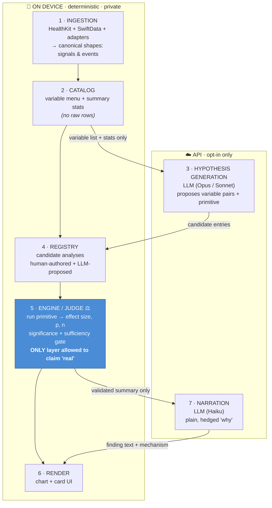

# Kampa — Insight Intelligence Architecture

> **Status:** Decided June 2026. This is the most fundamental design decision in Kampa so far — bigger than CloudKit sync. It defines *how the app turns raw sensor data into trustworthy insights*.

---

## The fork in the road

There were two tempting-but-wrong extremes for how Kampa generates insights:

| Extreme | Why it's wrong |
|---|---|
| **"Just ask an LLM."** Throw the CSVs at a model and let it tell us what correlates. | LLMs are not calculators. They estimate and pattern-match on text — they don't *compute* a correlation or a survival curve. Ask one to find patterns and it will, including ones that aren't there. For a health app, that's the worst possible failure. |
| **"Pure statistics, fixed forever."** A hand-coded engine that only ever runs the analyses one person thought to write. | Rigorous but blind. It can only find what was hand-modelled in advance. New variables and other users' data would carry signal the app simply can't see. |

**The resolution: don't choose. Layer them, and wall the LLM off from the one job it's catastrophic at — being the statistician.**

---

## The three-layer design

Each layer does only what it is genuinely good at.



| # | Layer | Job | Tool | Why this tool |
|---|---|---|---|---|
| 1 | **Ingestion** | Pull each variable in and map it to a shape | Code + adapters | Deterministic plumbing |
| 2 | **Catalog** | "What variables exist + their summary stats" | Code | The privacy-safe menu sent out for ideas |
| 3 | **Hypothesis generation** | Propose *what's worth testing* — incl. pairings the developer wouldn't think of | **LLM** | Breadth. Knows PD pharmacology; proposes *plausible* hypotheses |
| 4 | **Registry** | Hold the candidate analyses (human + LLM) | Code (config) | Composable list of questions |
| 5 | **Engine / Judge** ⚖ | *Actually test* each hypothesis + gate it | **Code only** | The only layer permitted to say a pattern is real |
| 6 | **Render** | Draw the chart + card | Code | Domain-specific, clinician-grade visuals |
| 7 | **Narration** | Explain the survivor in plain, hedged words | **LLM** | Voice. Good at language + framing |

**The golden rule:** the LLM is the *imagination* (layer 3) and the *voice* (layer 7). It is **never** the *judge* (layer 5). Only deterministic statistics can promote a hypothesis to a visible insight.

---

## The three building blocks (crisp definitions)

These are the parts that make the engine extensible. Think of a kitchen:

| Block | Definition | Kitchen analogy | Examples |
|---|---|---|---|
| **Adapter** | Brings a **new stream of data** into the system. One per variable. Fetches it (HealthKit query) or captures it (logging UI), then maps it to a canonical *shape*. | **The ingredient** — gets it into the kitchen | caffeine, boxing, Tai Chi, CGM glucose, constipation |
| **Primitive** | A reusable **statistical method** that operates on *shapes*, not on specific variables. It neither knows nor cares which variable it's fed. Built once, reused forever. | **The cooking technique** — sautéing works on any vegetable | windowed-effect, lag-correlation, dose-response curve, survival / duration, long-term trend |
| **Registry** | The list of **questions**. Each entry wires one variable pair to one primitive with parameters. It is *configuration, not new code*. | **The recipe card** — "sauté *this* ingredient *this* way" | `caffeine ↔ tremor` via windowed-effect (4h)<br>`dose ↔ tremor` via dose-response (by time-of-day) |

### The two shapes everything reduces to

Every adapted variable is exactly one of:

- **Continuous signal** — a value that exists over time. *(tremor, HRV, glucose, gait speed)*
- **Discrete event** — a thing that happened at a timestamp. *(a dose, a meal, a coffee, a workout)*

Primitives are written against these two shapes — which is *why* one primitive serves many variables. "What is the effect of an **event** on a **signal** in the hours after it?" is the same math whether the event is a levodopa dose or a cup of coffee.

### How they compose

```
Adapter (caffeine)  +  Primitive (windowed-effect)  +  Registry entry (caffeine ↔ tremor, 4h)
        ↓                        ↓                                ↓
   data flows in          math runs on it                question gets asked
                                  ↓
                    Engine/Judge gates it → card + chart appears IF (and only if) the
                    user's own data clears the significance + sufficiency bar.
```

**Adding a new variable is a thin, mostly-declarative act:** write one adapter + one registry line. Everything downstream — running on every user, gating, charting, narrating — is automatic and per-user.

---

## What's automatic vs. what needs a human

| Step | Automatic? |
|---|---|
| Stats run on each user's own data | ✅ |
| Show / hide per user via the significance gate | ✅ |
| A serviceable chart (the primitive's default renderer) | ✅ |
| The numeric "finding" text | ✅ |
| Getting a variable's **data** into the app | ❌ — adapter (small, once) |
| The variable-pair **question existing** | ❌ — registry entry (human-curated, *or* LLM-proposed) |
| A **polished, bespoke** chart + the mechanism "why" | ❌ — hand-authored *or* LLM narration |

**The one burden that never automates away:** you cannot analyze data you do not collect. The LLM can propose "test temperature vs. tremor," but if temperature isn't a stream, there's nothing to test. The adapter is permanent and human.

---

## Why this beats pure LLM "discovery" — on quality *and* safety

- **Quality.** The insights we've already built encode domain-specific statistical models a generic scanner could never invent — e.g. dose-response = onset-latency *by time-of-day bucket, truncated at the next dose, baseline-corrected*; wearing-off = *Kaplan-Meier survival with censoring*. Automated discovery only ever produces shallow "X correlates with Y" cards. **The primitives carry clinician-grade quality; the LLM carries breadth.**
- **Safety.** Scanning every variable pair for "anything significant" is a false-discovery machine — test enough pairs at p<0.05 and chance alone manufactures hits. The LLM's value is as a *prior*: it proposes only *mechanistically plausible* hypotheses, which keeps the number of tests small and each hit more likely to be real. The gate then enforces discipline: multiple-comparison correction, minimum effect size, minimum n, and replication across time windows before anything is shown.

---

## Privacy boundary

Raw health data **never leaves the device.** The two opt-in API hops carry only:

1. **Outbound for hypotheses:** the variable *menu* + summary statistics (not rows).
2. **Outbound for narration:** the *validated derived summary* (the numbers a finding rests on).

On-device: ingestion, catalog, registry, engine/judge, gate, rendering.
API (opt-in): hypothesis generation, narration.
This is consistent with the existing CloudKit ≠ third-party-API boundary.

---

## The three existing cards are *not* discarded

Today's cards (afternoon-dose, wearing-off, gait) are bespoke functions that bundle four things together:

```
afternoonDoseInsight()  =  [data selection] + [statistical method] + [chart] + [hardcoded text]
```

The refactor **decomposes** them into the reusable layers — nothing of value is lost:

| Today (bundled) | After (decomposed into reusable parts) |
|---|---|
| `afternoonDoseInsight()` | **primitive:** windowed dose-response · **registry:** dose ↔ tremor · **renderer:** multi-curve chart |
| `wearingOffInsight()` | **primitive:** survival / ON-duration (Kaplan-Meier) · **registry** · **renderer:** trough-annotated curve |
| `gaitInsight()` | **primitive:** long-term trend (regression over monthly medians) · **registry** · **renderer:** trend chart |

The statistics, the charts, and the **parity tests** all survive and get *reused*. The bespoke shells dissolve, but they become **the first three primitives and the gold-standard reference implementations** — the templates every future (LLM-proposed) analysis is held to. They are the proof that this architecture is buildable.

---

## Migration path (staged — nothing breaks)

1. Leave the three cards running exactly as-is.
2. Extract **one** primitive (start with gait's trend-regression — the cleanest). Re-express the card as `registry entry → primitive`. Parity tests prove the output is identical. Ship.
3. Repeat for dose-response, then survival. Three primitives + a thin registry, still producing today's exact cards.
4. Add the **gate** layer (significance + sufficiency + multiple-comparison correction).
5. Add **LLM hypothesis generation** feeding candidate registry entries.
6. Swap hardcoded narration for **LLM narration**, keeping today's strings as a deterministic fallback.

Each step is independently shippable; the parity tests are the safety net.

---

## Rejected alternatives

| Considered | Verdict |
|---|---|
| LLM as the statistician (reads CSVs, reports correlations) | ❌ Hallucinates statistics; manufactures patterns. Unacceptable for health data. |
| Pure automated discovery (scan all variable pairs) | ❌ Brute-force; false-discovery machine; produces shallow, dangerous cards. |
| Hand-only registry (no LLM hypothesis layer) | ⚠️ Rigorous but capped at what the developer thought to model. Kept as the floor; LLM layer added on top for breadth. |
| **Three-layer: LLM proposes → engine judges → LLM narrates** | ✅ **Chosen.** Breadth of discovery with the rigor and quality of curated statistics. |
```
